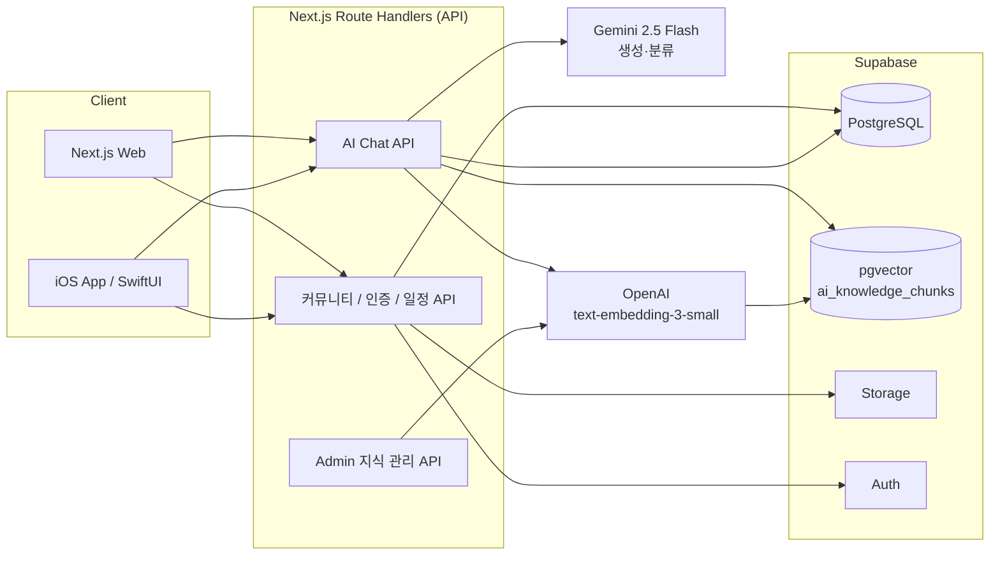
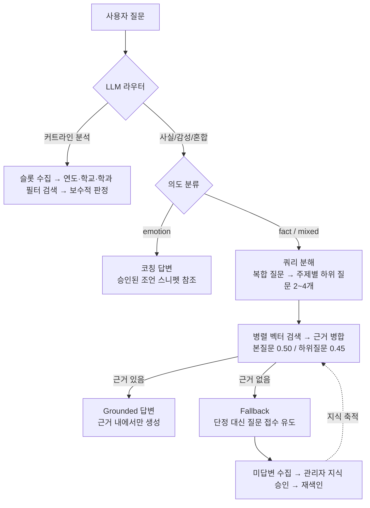

<div align="center">
  

  <h3>편입 준비생을 위한 신뢰 기반 정보 플랫폼</h3>
  <p>합격 인증 커뮤니티 · 편입 정보 허브 · 환각 없는 RAG AI 상담</p>

  
  
  
  
  
  
  
</div>

---

## 프로젝트 소개

**합격판**은 제가 독학으로 편입을 준비하면서 직접 겪은 **정보 비대칭 문제**를 해결하기 위해, 기획부터 개발·운영까지 전 과정을 혼자 구축한 편입 특화 플랫폼입니다.

편입 정보는 분명 존재하지만 네이버 카페, 디시인사이드, 학원, 선배 네트워크에 파편화되어 있고, 초심자는 어디까지가 신뢰할 수 있는 정보인지 판단하기 어렵습니다. 합격판은 이 문제를 네 가지 축으로 풉니다.

| 축 | 접근 |
|---|---|
| **신뢰** | 합격증 인증 기반 커뮤니티 — 검증된 경험 정보가 누적되는 구조 |
| **탐색** | 공지·일정·커트라인 데이터를 한 곳에 모은 편입 정보 허브 |
| **상담** | 승인된 지식만 검색에 사용하는 **환각 없는 RAG AI 상담** |
| **환류** | AI가 답하지 못한 질문 → 관리자 지식화 → 재색인 → 답변 개선 루프 |

핵심 설계 철학은 *"AI를 일회성 기능이 아니라, 사용자 질문이 다시 제품의 지식 자산이 되는 운영 루프로 만든다"* 입니다.

## 주요 기능

- **편입 특화 커뮤니티** — 자유게시판·합격전략·학습질문·합격수기, 실시간 인기글, 웹/iOS 동일 API
- **합격 인증 시스템** — 합격증 제출 → 운영 검수 → 신뢰 사용자 구조
- **편입 정보 허브** — 최신 공지/일정, 커트라인 데이터센터
- **RAG AI 상담 '합곰'** — 질문 유형별 라우팅, 쿼리 분해 검색, SSE 스트리밍, 커트라인 전용 분석 플로우
- **운영자 도구** — 지식 승인/재색인, 미답변 질문 집계, AI 대화 로그·관측 지표 대시보드
- **iOS 앱** — SwiftUI 기반, 웹과 동일 API 소비 (App Store 출시)

## 시스템 아키텍처



## AI 상담 파이프라인

단일 프롬프트 챗봇이 아니라, 질문 성격에 따라 경로가 갈리는 **라우팅 + 검색 + 근거 기반 생성** 구조입니다.



- **환각 방지**: `status = approved` 지식만 검색 대상. 근거가 없으면 답을 지어내지 않고 질문 접수로 유도
- **지식 환류**: fallback 질문이 관리자 화면에 쌓이고, 승인 시 증분 재색인 → 같은 유형의 다음 질문부터 답변 가능
- **운영 인프라**: 질문 정규화 기반 캐시(지식 revision으로 자동 무효화), traceId·단계별 latency·cache hit/retrieval 상태를 남기는 관측 테이블, SSE 스트리밍

## 기술적 도전과 해결

실제 운영 데이터를 측정해서 문제를 찾고 고친 과정입니다.

### 1. 임베딩 유사도 문턱을 "감"이 아니라 데이터로 잡기

**문제** — 지식을 채워 넣어도 AI가 계속 "모른다"고 답하는 현상. 운영 DB에 저장된 질문을 **토씨 하나 안 바꾸고 그대로 검색해도 5개 중 4개가 걸러지는** 것을 실측으로 확인했습니다.

| 검색 시나리오 | top 유사도 실측 | 기존 문턱 0.70 | 변경 0.50 |
|---|---|---|---|
| 저장된 질문 원문 그대로 | 0.598 ~ 0.782 | 1/5 통과 | 5/5 통과 |
| 표현만 바꾼 질문 (실사용) | 0.530 ~ 0.730 | 1/5 통과 | 5/5 통과 |
| 무관한 청크 (노이즈) | 0.35 ~ 0.51 | — | 대부분 차단 |

**원인** — `text-embedding-3` 계열은 구세대 모델(ada-002) 대비 유사도 분포 자체가 낮게 형성되는데, 문턱은 구모델 기준(0.7+)으로 설정돼 있었습니다.

**해결** — 정답과 노이즈 분포가 갈리는 경계인 **0.50**으로 조정. 문턱값이 캐시 키에 포함되는 구조라 기존 캐시와 자동 분리되어 무중단 적용.

### 2. 복합 질문 검색 실패 → 쿼리 분해 (Query Decomposition)

**문제** — "1학년 학점 3.69인데 연세대~홍익대 기계공학과 편입 방향성 잡아줘" 같은 복합 질문은 여러 주제가 벡터 하나로 뭉개져, 관련 지식이 있어도 top 유사도가 0.475에 그쳐 검색 실패.

**해결** — LLM이 질문을 주제별 하위 질문 2~4개로 분해 → 배치 임베딩 → 병렬 검색 → 근거를 유사도 기준으로 병합. 나열된 대학을 대학별로 쪼개지 않고 주제 단위로 묶도록 few-shot 예시로 제어.

**결과** — 동일 질문 기준 검색된 근거 **0개 → 6개**, fallback 대신 "연고대는 개별 준비 / 나머지는 공통 전형" 구분까지 반영된 근거 기반 답변 생성. (관련 연구: [Question Decomposition for RAG, ACL 2025](https://arxiv.org/abs/2507.00355) — MRR@10 +36.7%)

### 3. LLM 분류기 응답이 매번 잘리던 버그

**문제** — 라우터/의도 분류기의 JSON 응답이 `{"route` 에서 끊겨 항상 휴리스틱 폴백으로 동작. 원인은 **gemini-2.5-flash의 thinking 토큰이 `maxOutputTokens`(120)를 먼저 소모**해 실제 출력 예산이 남지 않는 것.

**해결** — 분류·분해처럼 작은 토큰 예산의 유틸리티 호출에 `thinkingConfig: { thinkingBudget: 0 }` 옵션을 추가해 thinking을 비활성화. 분류 정확도 복구와 함께 지연시간·비용도 감소.

### 4. 지식을 "통짜 답변"이 아니라 "부품"으로 쌓는 운영 원칙

개인 상황이 섞인 질문(학점·출신교·목표 대학 조합)은 경우의 수가 무한해 일회성 답변으로는 커버가 불가능합니다. 그래서 답변을 **일반화된 지식 단위**(예: "편입 학점 기준", "대학군별 전형 차이", "수학 노베이스 시작 전략")로 분해해 저장하고, LLM이 검색된 부품들을 조합해 개인 맞춤 답변을 생성하도록 운영합니다. 근거는 일반적이지만 답변은 개인화되고, 환각 위험 없이 커버리지가 늘어나는 구조입니다.

## 기술 스택

| 영역 | 기술 |
|---|---|
| Web | Next.js 16 (App Router), React 19, TypeScript, Tailwind CSS |
| Mobile | Swift / SwiftUI (iOS) |
| Backend | Next.js Route Handlers, Supabase (PostgreSQL · Auth · Storage · RLS) |
| AI 생성 | Gemini 2.5 Flash (라우팅 · 분류 · 쿼리 분해 · 답변 생성) |
| AI 검색 | OpenAI text-embedding-3-small (1536d) + pgvector (ivfflat, cosine) |
| 운영 | AI 관측 로그(traceId · latency · cache), 답변 캐시, eval 스크립트 |

## 프로젝트 구조

```
├── web/                          # Next.js 웹 + API
│   ├── app/api/ai/chat/          # AI 상담 파이프라인 (라우팅·분해·검색·생성)
│   ├── app/api/admin/knowledge/  # 지식 입력(단건/대량/PDF)·승인·재색인
│   ├── lib/aiRag.ts              # LLM·임베딩 클라이언트, 청킹, grounded 프롬프트
│   ├── lib/ragIndexing.ts        # 승인 지식 → 청크 임베딩 색인
│   ├── lib/aiChatCache.ts        # 질문 캐시 (지식 revision 기반 무효화)
│   └── lib/aiObservability.ts    # AI 응답 관측 지표 적재
├── ios/HapgyeokpanApp/           # SwiftUI iOS 앱
└── docs/                         # 기획·개발 문서
```

## 개발 범위

문제 정의 → 서비스 기획 → UX/정보구조 설계 → 데이터 모델링 → RAG 파이프라인 설계·구현 → 관리자 운영도구 → 웹/iOS API 연동 → App Store 출시까지 **전 과정 1인 개발**.

---

<div align="center">
  <sub>독학 편입생이 겪는 정보 비대칭을, 직접 만든 제품으로 해결하기 위해 시작한 프로젝트입니다.</sub>
</div>
